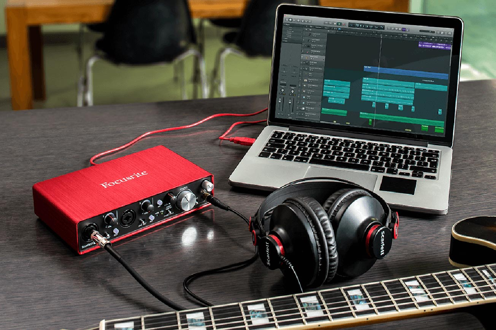
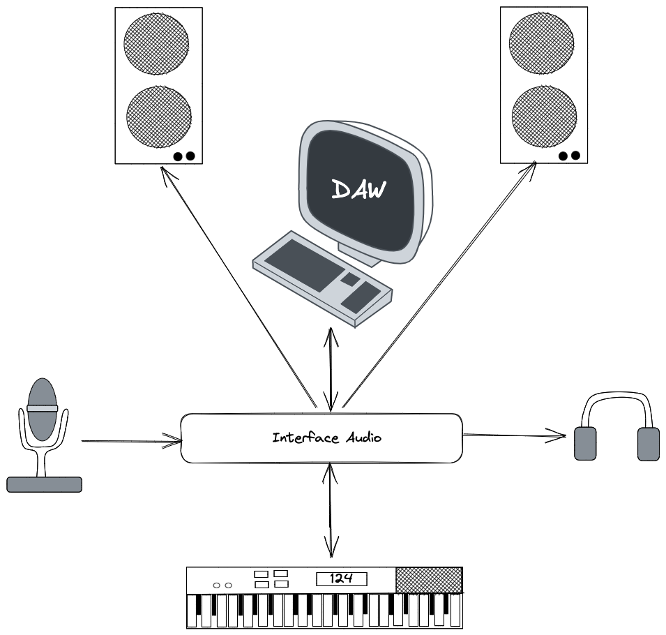
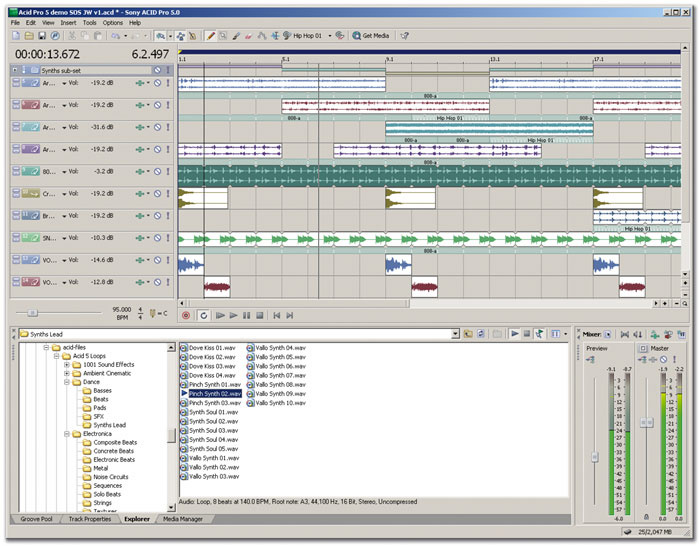
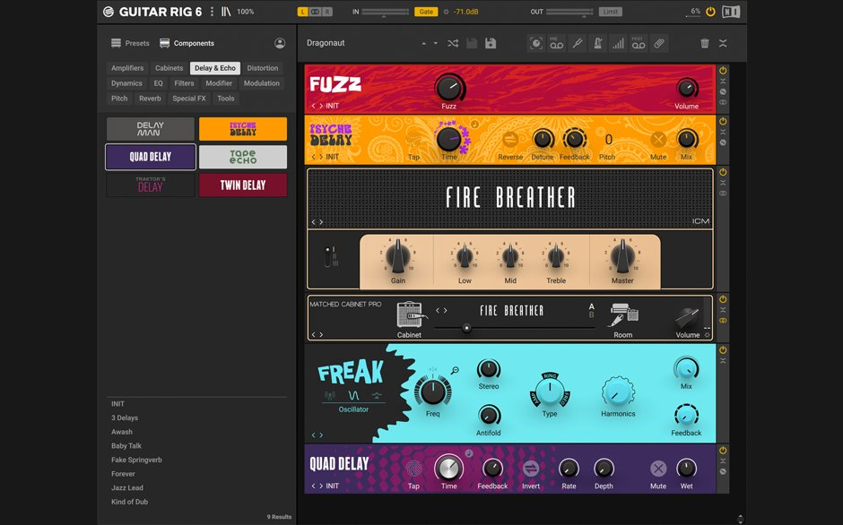
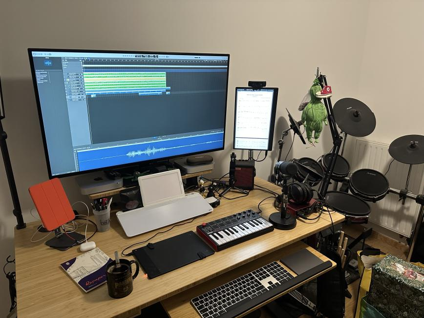

**Résumé:**
Dans ce tout premier article,
je vous explique brièvement ce qu'est un homestudio,
pourquoi ça pourrait vous intéresser,
et surtout pourquoi ce n'est pas nécessairement compliqué ou cher de monter le sien.

# Un homestudio c'est quoi ?
Un homestudio est un studio de musique ou de production audio-visuelle qui se trouve chez soi,
dans sa maison ou son appartement,
même s'il peut aussi être mobile grâce à la miniaturisation du matériel qui permet de monter de véritables studios qualitatifs avec des ordinateurs portables et des interfaces audio de taille réduites.
Il peut être utilisé pour enregistrer, mixer et produire de la musique, des podcasts, des vidéos ou tout autre type de projet audio-visuel.

 

# Il y a quoi dedans ?
Un homestudio comprend au moins un ordinateur (ou un appareil équivalent) avec un logiciel de production audio ou DAW (Digital Audio Workstation),
une interface audio (carte son) pour convertir le signal audio en entrée en provenance d'un microphone ou d'un instrument vers un format reconnu par le DAW,
et un casque ou des enceintes pour restitution le son en sortie.
Ensuite,
en fonction des besoins,
s'y ajoutera éventuellement un microphone s'il y a besoin de capter de la voix ou des sons, comme par exemple en provenance d'instruments acoustiques,
un clavier maitre midi pour contrôler le DAW et poser des sections musicales,
des pads pour faciliter la pose de parties percussives ou le déclenchement de samples,
des plugins pour le DAW, etc, etc...

 

Les homestudios peuvent être très simples, avec juste quelques éléments de base, ou plus complexes, avec une grande variété d'équipements et de logiciels. Ils sont souvent utilisés par des musiciens indépendants, des podcasters, des vidéastes ou toute personne souhaitant avoir un espace de travail pour produire du contenu audio-visuel de manière professionnelle chez elle.

Ils ne servent pas uniquement à l'enregistrement pour les créateurs les plus avancés,
mais peuvent aussi être de très avantageux environnements d'apprentissage musical,
équipés de nombreux outils pour apprendre, se corriger et progresser efficacement.

# Pour faire quoi ?
Il y a plusieurs raisons qui peuvent pousser à vouloir monter son homestudio,
et il n'y a pas de réponse universelle à la question _"pour faire quoi ?"_,
je vais donc vous partager MON cas d'usage et pourquoi j'ai monté le mien.

Lorsque j'ai monté mon premier homestudio,
c'était pour pouvoir enregistrer mes progrès à la guitare,
enregistrer des idées de mélodies ou de rythmiques,
des backing tracks pour pouvoir tenter d'improviser par dessus,
des exercices et des reprises de morceaux pour pouvoir me réécouter et déceler mes erreurs, les corriger et progresser.
Mon utilisation n'était pas très créative:
le homestudio était un outil d'apprentissage de la musique,
pas un outil de création.
Je jouais toujours sur mon ampli et,
quand j'en avais envie,
je branchais la sortie de l'ampli sur la carte son pour enregistrer (oui oui, je sais, c'est pas la bonne façon, j'en parlerai dans un futur article).

 

Plus tard,
j'ai découvert qu'il existait des logiciels de simulation d'ampli et d'effets qui pouvaient s'utiliser de manière autonome ou bien intégrés à un DAW.
En investissant dans un logiciel,
je pouvais avoir accès a tout un tas d'amplis et d'effets que je ne possédais pas,
et que je n'aurai pas eu les moyens d'acheter avec mes finances de l'époque.
En branchant ma guitare directement sur la carte son,
je pouvais passer d'un son clair type guitare acoustique a une bonne grosse saturation de metal,
d'un simple clic,
et m'entendre en temps réel pendant que je jouais.
J'ai rapidement délaissé l'ampli pour ne me brancher que sur la carte son,
puis j'ai découvert le gros bonus:
il est possible d'enregistrer le son brut de la guitare,
sans simulation d'ampli ou d'effets,
puis de laisser le DAW appliquer les simulations au playback.
En d'autres termes,
si le son ne me convient pas,
je peux le retravailler à volonté et tester différentes combinaisons d'effets et réglages d'ampli sans avoir besoin d'enregistrer à nouveau toute la piste.

 

J'ai ensuite commencé à jouer en groupe,
et là mon utilisation du homestudio a évoluée.
Il a servi a enregistrer des idées pour les envoyer aux membres du groupe et retravailler mes parties en fonction de leurs commentaires entre deux répétitions.
À l'occasion,
un autre membre du groupe passait une soirée à la maison,
posait sa partie,
et progressivement nous avions un projet qui devenait de plus en plus abouti...
avant de mettre la main au porte-feuille et d'aller faire une vraie session d'enregistrement en studio ($$$) quand le résultat était déjà assez satisfaisant sur mon propre studio.

Depuis,
il me sert un peu à tout ça mais j'y apprends également la production musicale.
J'ai fait évoluer ma configuration avec le temps,
j'ai investi dans du matériel et des logiciels,
et aujourd'hui mon homestudio m'est devenu indispensable puisque je ne joue presque plus sur ampli.
Il me sert aussi bien dans ma pratique et mon apprentissage au quotidien,
que pour expérimenter et créer,
seul ou en groupe.
À tel point que j'ai pris la décision de suivre une formation en production musicale pour professionnaliser un peu tout ça.

Donc à la question "pour quoi faire ?",
rien que dans mon usage personnel ça a couvert un large panel de cas depuis mon apprentissage de la musique à la composition en passant par la production.
Je ne peux QUE recommander à tous d'avoir un studio personnel,
aussi minimaliste soit-il,
pour pouvoir utiliser la large panoplie d'outils qu'offre la music assistée par ordinateur y compris dans la simple pratique d'un instrument sans aucun objectif de production ou de création.

# Se monter un homestudio ça coûte cher ?
Monter un homestudio peut être coûteux,
mais cela dépend surtout de vos besoins,
de ce dont vous disposez déjà comme matériel et de votre budget.

Si vous êtes débutant et que vous cherchez à enregistrer et à mixer de la musique de manière simple et abordable, il est possible de monter un homestudio avec un budget relativement modeste en acceptant quelques contraintes.
Mais si vous êtes un professionnel ou si vous cherchez à obtenir des résultats de haute qualité, vous devrez peut-être dépenser plus pour obtenir l'équipement et les logiciels nécessaires.

Lorsque j'ai débuté,
j'étais étudiant et j'avais très peu d'argent à investir là dedans.
Mon studio était très très basique,
je n'avais pas les moyens d'avoir une machine dédiée:
un simple PC pas trop puissant sous Windows 7 qui me servait aussi à faire mes études,
une carte son externe d'entrée de gamme (et surtout d'occasion),
des enceintes d'entrée de gamme aussi et un DAW d'entrée de gamme.
En réutilisant mon ordinateur d'étude,
l'investissement total m'avait coûté un peu plus d'une centaine d'euros entre l'interface audio, les enceintes et le logiciel.
C'était suffisant pour mes besoins de l'époque qui couvrent probablement ceux de la plupart des gens qui débutent et n'ont pas besoin de plus que de travailler quelques pistes avec une poignée d'effets.

Aujourd'hui,
j'ai deux studios entre mon studio fixe et mon studio portable.
Avec les différentes machines, interfaces audio, logiciels et micros,
je dois avoir investi autour de 2500 à 3000 euros,
ce qui est bien au-dessus de ce dont ont besoin la grande majorité des amateurs,
et bien en-dessous de ce dont ont besoin la plupart des professionnels.

 

Entre le homestudio a 100 EUR et celui à 3000 EUR,
il y a une énorme marge.
Avec un budget plus limité,
j'aurai trouvé comment faire avec moins,
et avec un budget illimité,
mon studio aurai probablement encore une dizaine d'appareils et de plugins supplémentaires.
Tout est question de budget et de ce que vous voulez en faire:
il y a toujours moyen de faire quelque chose de sympa avec vos moyens et quelques compromis.

# Pour conclure
Avec les années,
et un niveau de vie qui a énormément varié dans l'intervalle,
j'ai tenté différentes approches avec différents budgets.
J'ai utilisé des PC sous Windows et Linux ainsi que des Mac,
j'ai utilisé différentes interfaces audio externes,
différents DAW,
différents casques,
différentes simulations d'ampli et d'effets.

Aujourd'hui,
loin d'être un expert,
j'ai quand même engrangé suffisamment d'expérience pour faire un retour sur ce qui a été agréable ou non à l'utilisation,
ce qui a été utile ou a pris la poussière,
et sur le matériel et les logiciels que j'ai conservé et ceux que j'ai revendus.

Ce blog présentera quelques solutions pour monter son environnement de travail,
aussi bien avec trois bouts de ficelle qu'en mettant un budget "correct",
pour que chacun y trouve son compte aussi bien pour s'enregistrer seul assis dans le canapé de son salon que pour des projets à plusieurs musiciens dans des conditions correctes.

Je parlerai aussi bien du logiciel que du matériel et du mobilier,
et je donnerai quelques astuces sur comment s'enregistrer correctement,
comment démarrer des projets quand on y connait rien et les erreurs à éviter.
